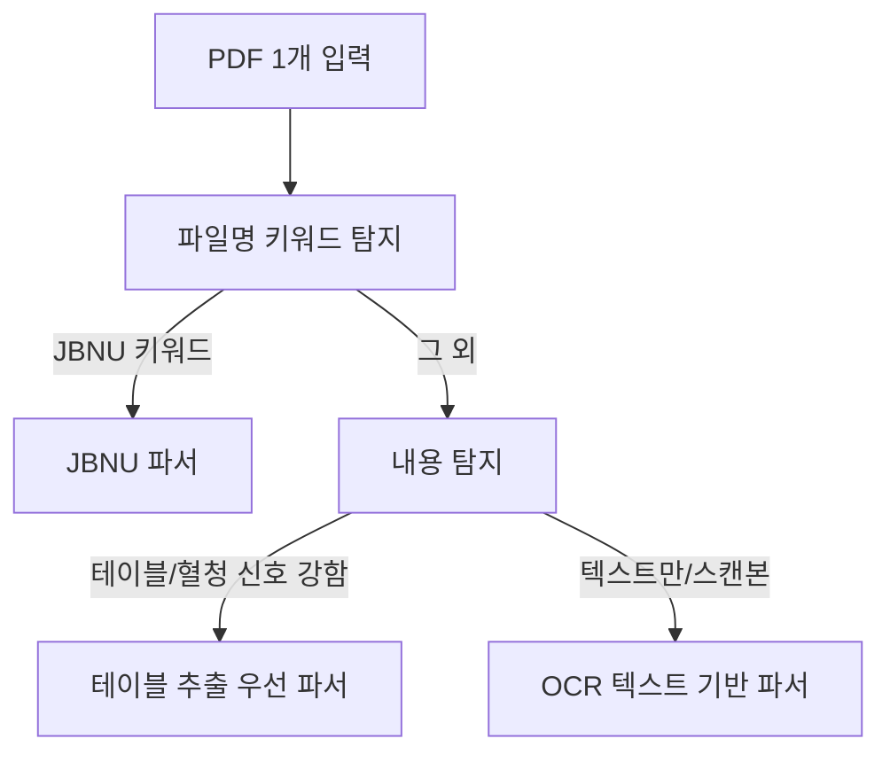

# 항체가 PDF OCR 규칙 (PRRS/MH/APP/Lawsonia/FMD/SIV)

> 목적: 혼재된 기관/양식의 항체가 결과서 PDF를 파싱하여 **표본 1개=DB 1행**(`antibody_titers`)으로 저장한다.  
> 제품 범위/저장 합의는 [`TITER-TRACKING-SPEC.md`](TITER-TRACKING-SPEC.md) 참조.

---

## 1. 파서 라우팅(입력 분류) 규칙

### 1.1 파일명 기반 1차 분류(우선)

- **전북대(JBNU)**: 파일명에 아래 키워드가 포함되면 전북대 파서를 탄다.
  - 키워드: `jb5219` / `전북대` / `네스트`
  - 근거: 현재 파서 팩토리 [`ocr-pipeline/app/parsers/__init__.py`](../ocr-pipeline/app/parsers/__init__.py) 및 전북대 파서 [`ocr-pipeline/app/parsers/jbnu.py`](../ocr-pipeline/app/parsers/jbnu.py)

- 그 외: 기본 파서(옵티팜 등)로 시작하되, 아래 1.2의 내용 기반 분류로 “혈청(ELISA) 항체가”를 재판단한다.

### 1.2 내용 기반 2차 분류(혼재 양식 대응)

PDF 텍스트/테이블에서 아래 신호를 탐지한다.

- **ELISA/혈청/항체가 신호**
  - `혈청`, `ELISA`, `항체`, `S/P`, `검체번호`, `판정`
- **대상 질병 신호(초기)**
  - PRRS / MH / APP / Lawsonia(회장염) / FMD(구제역) / SIV(인플루엔자)

판단 흐름(개념):



---

## 2. OCR/테이블 추출 우선순위

혼재 양식에서 정확도를 위해 아래 우선순위를 고정한다.

1. **디지털 PDF 텍스트 레이어**(pdfplumber `extract_text`)가 충분하면 그대로 사용
2. **테이블형이면 `extract_tables` 우선** (pdfplumber `extract_tables`)
3. 텍스트가 부족하면 **Tesseract OCR**로 폴백

근거: [`ocr-pipeline/app/ocr.py`](../ocr-pipeline/app/ocr.py) 구현 흐름.

---

## 3. 표본(10~50두) 추출 규칙

### 3.1 표본 식별자

우선순위:

1. 결과서의 **검체번호/검체ID/순번** 컬럼(있으면 그대로 저장)
2. 없으면 **테이블 행 index**를 `animal_no`로 사용(1..N)

### 3.2 수치 파싱(`sp_value`)

- 기본: `S/P` 형태 실수(예: `0.015`, `0.42`)를 저장
- 예외: 셀에 `0.03 (-)` 같이 “수치 + 괄호 판정”이 섞인 경우는
  - 수치는 `sp_value`로 저장
  - 판정은 필요 시 향후 `judgement` 컬럼(또는 요약 테이블)로 분리

Sanity check:

- 파싱된 수치가 비정상 범위(예: 매우 큰 값)면 `raw_text`에 남기고 해당 표본은 오류 플래그로 분류(§6).

---

## 4. 농장/날짜 결정 규칙 (merge key 핵심)

### 4.1 날짜

- 기본: **접수일자**를 `test_date`로 사용 (기존 전북대 정책과 정합)
- 파일명 날짜와 접수일자가 충돌하면:
  - 접수일자가 존재하면 접수일자 우선
  - 접수일자가 없으면 파일명 날짜 사용

### 4.2 농장 코드(익명 `farm_code`) + 원문 `farm_id`

- 항체가 저장의 기본 키는 **익명 코드 `farm_code`(숫자 4자리)** 로 고정한다.
  - 다비육종 농장의 경우 `DB1001`, `DA1001` 같은 접두어가 있어도 **뒤 4자리만 사용**: `1001`
  - 목표: UI/공유/특허 문서에서 익명성을 유지(농장명은 저장/노출 최소화)
- 파서가 추출한 농장명(원문)은 필요 시 `farm_id`(원문 텍스트)로 별도 저장할 수 있으나, 조회/비교는 `farm_code` 중심으로 한다.
- 매핑/정규화가 실패하면:
  - “미분류로 저장”하지 않고 **오류목록**으로 남긴다(§6). 추후 alias 추가/규칙 보강 후 재처리.
- 매핑 실패 시:
  - “미분류로 저장”하지 않고 **오류목록**으로 남긴다(§6). 추후 alias 추가/규칙 보강 후 재처리.

---

## 5. 질병 매핑 규칙(초기 6종)

표준 값:

- `PRRS`
- `MH`
- `APP`
- `Lawsonia`
- `FMD`
- `SIV`

실제 PDF 표기(한글/영문/약어)는 §7 매핑표를 따른다.

---

## 5.1 요약 판정 규칙(+ / ? / -)

원시 표본(`sp_value`)을 저장한 뒤, 같은 `(farm_code, test_date, disease)` 그룹에서 아래 규칙으로 **요약 판정**을 만든다.

- 공통 규칙(질병별 임계값으로 `양성/의양성/음성`을 먼저 판단):
  - 표본 중 **하나라도 양성** → 전체 요약 `+`
  - 양성은 없고 표본 중 **하나라도 의양성** → 전체 요약 `?`
  - 전부 음성 → 전체 요약 `-`

질병별 임계값(현재 확정):

- `PRRS`: `sp_value >= 0.4` → 양성, `0.3 <= sp_value < 0.4` → 의양성, 그 외 음성
- `MH`: PRRS와 동일
- `APP`: `sp_value >= 50` → 양성, `40 <= sp_value < 50` → 의양성, 그 외 음성
- `SIV`: `sp_value <= 0.6` → 양성, `sp_value > 0.6` → 음성 (의양성 없음)

> `Lawsonia`, `FMD` 임계값은 기관/검사법에 따라 달라질 수 있어, 실제 결과서 샘플을 보고 별도 확정한다.

---

## 6. 실패/품질 리포트(재현 가능하게)

파일 단위로 아래를 **엑셀 결과 시트 외**(로그/오류목록/리포트 파일)로 남긴다.

- `파일명`
- `파서명`
- `분류결과`(JBNU/테이블우선/OCR텍스트 등)
- `추출 표본수`
- `필수필드 누락`(farm/date/disease 등)
- `원본 PDF 경로`(가능하면)
- `덤프`
  - (선택) 1페이지 텍스트 일부
  - (선택) 테이블 1~2개 스냅샷(행/열)

목표: “왜 실패했는지”를 로그만으로 재현 가능하게.

### 6.1 오류목록(Excel sheet) 최소 스키마

`ocr-pipeline/output/results.xlsx`의 `오류목록` 시트(또는 별도 CSV)에는 최소 아래 컬럼을 유지한다.

| 컬럼 | 의미 |
|---|---|
| `파일명` | 원본 PDF 파일명 |
| `파서` | 사용된 파서 클래스명 |
| `분류결과` | JBNU/테이블우선/OCR텍스트 등 |
| `오류코드` | `NO_FARM` / `NO_DATE` / `NO_DISEASE` / `NO_SAMPLES` / `TABLE_EXTRACT_FAIL` / `OCR_FAIL` 등 |
| `오류` | 예외 메시지 또는 요약 |
| `표본수` | 추출된 표본 수(0 포함) |
| `pdf_path` | 가능하면 원본 경로 |

### 6.2 덤프(재현 파일) 형식

파싱 실패/애매 케이스는 **파일명 기반으로 덤프를 남긴다**(경로는 환경에 따라 다르므로 상대 경로 권장).

- `ocr-pipeline/output/titer-dumps/{short_file_key}.json`

필드 예:

```json
{
  "filename": "20250305_2006대월(...)_jb5219_PRRS ELISA.pdf",
  "parser": "JbnuParser",
  "classified_as": "JBNU_TABLE",
  "meta": { "farm_raw": "...", "farm_code": "DB2006", "test_date": "2025-03-05" },
  "signals": { "has_table": true, "has_sp": true, "has_serum_keywords": true },
  "tables_preview": [[[\"VDC 순번\", \"검체번호\", \"S/P값\", \"판정\"], [\"1\", \"...\", \"0.015\", \"음성\"]]],
  "text_preview": "....",
  "error": { "code": "NO_SAMPLES", "message": "..." }
}
```

> 덤프는 개인정보 최소화(농장명 대신 farm_code, 본문은 preview로 짧게) 원칙.

---

## 8. 검증 데이터셋(샘플셋) 구성 계획

목표: “파서가 돌아간다”가 아니라 **정답(표본 수치) 기준으로 정확도**를 확인한다.

### 8.1 샘플셋 구성(최소)

- **기관/양식별 3~5개 PDF** (총 10~15개 수준부터 시작)
- 각 PDF에 대해 아래가 다양하게 포함되도록 선택:
  - 디지털 텍스트 레이어(테이블 추출 가능) vs 스캔본(OCR 필요)
  - 표본 수 10두 / 30두 / 50두 케이스
- PRRS/MH/APP/Lawsonia/FMD/SIV 각각 최소 1개 이상
  - 파일명에서 농장코드 추출 가능한 케이스 vs 애매한 케이스

### 8.2 정답지(ground truth) 만들기

각 PDF별로 “정답 테이블”을 만든다(엑셀/CSV 중 택1).

필드:

- `filename`
- `farm_code`
- `test_date`
- `disease`
- `test_type`
- `animal_no`(또는 검체번호)
- `sp_value`

정답은 수동으로 1회만 만들고, 이후 파서 변경 시 회귀 테스트에 재사용한다.

### 8.3 합격 기준(초기)

- 필수 필드(farm/date/disease) 누락률 0%
- 표본 수(샘플 개수) 정확도: 100% 또는 “누락/추가 1개 이하” 같은 임계(출원 전에는 100% 권장)
- 수치 일치: 소수점 반올림 오차 허용(예: ±0.001)

---

## 7. 질병 표기 매핑표

초기(출원 전) 지원 범위의 **동의어/표기 변형**을 아래처럼 표준화한다.

| 표준 disease | 매칭 후보(예시) | 비고 |
|---|---|---|
| `PRRS` | `PRRS`, `PRRSV`, `PRRS 항체`, `PRRS Ab`, `PRRS ELISA`, `PRRSV 항체` | 항체/혈청/ELISA 문맥에서만 항체가 대상으로 취급 |
| `MH` | `MH`, `Mycoplasma hyorhinis`, `M. hyorhinis`, `마이코플라즈마 하이오라이니스`, `하이오라이니스` | 결과서가 “호흡기 ELISA”로 뭉뚱그려도 컬럼/주석으로 분리 가능해야 함 |
| `APP` | `APP`, `Actinobacillus pleuropneumoniae`, `A. pleuropneumoniae`, `흉막폐렴`, `흉막폐렴균` | ELISA/항체 문맥 우선 |
| `Lawsonia` | `Lawsonia`, `Lawsonia intracellularis`, `회장염`, `로손니아` | “회장염” 표기는 다른 장염과 혼동 가능 → 가능하면 영문 병기 확인 |
| `FMD` | `FMD`, `구제역`, `Foot-and-mouth disease` | 기관에 따라 단위/스케일이 다를 수 있어 `titer_value` 해석을 별도 필드로 확장할 수 있음 |
| `SIV` | `SIV`, `인플루엔자`, `Swine influenza`, `Influenza` | 항체가/혈청 문맥(ELISA/HI 등)에서만 대상. 임계값은 §5.1 |

추가 규칙:

- 문서/표에서 `Myco`는 기존 코드에서 “세균” 범주로 쓰였으므로, 항체가 추세 범위에서는 **MH와 혼동 금지**(필요 시 `Myco` 별도 disease로 추가).

