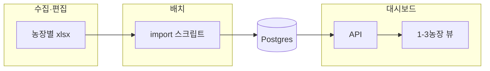

# PRRS·MH·APP 항체가 추세(1~3농장) — 저장·표시 설계

> **채택(2026-04-06)**: 농장당 엑셀 1파일 + `도/시군/면` 폴더 구분.  
> **앱은 엑셀을 직접 읽지 않음** — 엑셀은 **수집·편집·백업**용, **DB가 조회 정본**이다.

---

## 1. 제품 범위

| 항목 | 내용 |
|------|------|
| 사용자 | **농장주 탭**, **담당 수의(vet_assigned)** — 필요 시 동일 패턴으로 확장 |
| 비교 | **한 농장** 또는 **2~3농장**만 선택해 추세·비교 |
| 비범위 | 전 농장 매트릭스에 항체가 수치 노출 **불필요** (기존 매트릭스는 양성/음성 등 요약 유지) |

---

## 2. 화면(그리드) 개념

- **행**: 일령 구간(예: 30, 40, 50, …, 180일) + **산차** 구분(후보돈, 1산, 2산, 3산, 4산 이상 등 — 코드화해 고정)
- **열**: 질병/검사(예: PRRS, MH, APP …)  
- **시간 축**: 검사일(또는 접수일) — 열 그룹 헤더 또는 별도 “날짜 슬라이스”로 표현 (구현 단계에서 피벗 규칙 확정)
- **셀**: 해당 조합의 **항체가 수치**(S/P 등) — 다두 검사 시 표본별 행 또는 집계 규칙(평균·중앙값·양성두 비율)은 구현 시 명시

---

## 3. 파일 저장(운영·NAS)

```
{기준루트}/{도}/{시군}/{면_또는_읍면단위}/{farm_code}_titer.xlsx
```

- **파일 1개 = 농장 1개** (다농장 비교는 UI에서 최대 3개 `farm_code` 선택 후 **DB에서** 조회).
- 폴더 깊이는 **사람·백업·권한**용; 앱 런타임은 경로를 직접 스캔하지 않는 것을 원칙으로 함.
- 파일명 규칙(예: `{farm_code}_titer.xlsx`)은 import 스크립트와 문서에 동일하게 적는다.

**다중 탭으로 여러 농장을 한 통합 파일에 넣는 방식은 채택하지 않음** (농장당 1파일로 단순화).

---

## 4. 데이터 흐름 (엑셀 ≠ 런타임 소스)



- **장점**: 조회 속도, 캐시, RBAC, 동시 사용자, 버전 일관성.
- Import는 **주기 실행 파이프라인에 넣을지 / 수동 실행할지**는 추후 결정 (초기에는 수동 `npx tsx scripts/...` 도 가능).

---

## 5. DB 방향 (구현 전 설계 메모)

- `test_records` 한 행에 `+/-`만 두는 현재 모델만으로는 **10~50두 개별 S/P** 보존이 부족함.
- 권장: **요약 1행**(매트릭스·알림용) + **표본/롱 테이블** `(farm, date, disease, age_bucket, parity_group, sample_index, sp_value, …)` 또는 동등한 JSON 컬럼(쿼리 난이도 trade-off).
- 상세 DDL·컬럼명은 구현 티켓에서 `init-db`·마이그레이션과 함께 확정.

### 5.1 익명 키(`farm_code`) 규칙

- 항체가 추세/비교에서의 기준 키는 **익명 `farm_code`** 를 사용한다.
- 다비육종 농장들은 `DB1001`/`DA1001`처럼 접두어가 붙을 수 있으므로, 항체가 파싱에서는 **뒤 4자리 숫자만 `farm_code`로 인식**한다.
  - 예: `DB1001` → `1001`, `DA2015` → `2015`
- 원문 농장명/표기는 필요 시 별도 필드로 보관하되(예: `farm_id`), UI 기본 노출은 `farm_code` 중심으로 한다.

---

## 6. 구현 계획 (단계)

| 단계 | 내용 |
|------|------|
| **A. 스키마** | 표본(또는 long row) 테이블 추가, `farm_code`·`test_date`·`disease` 인덱스 |
| **B. Import** | 위 폴더 규칙 또는 단일 `--file=` 로 xlsx 읽기 → DB upsert (idempotency 키: 파일 해시 또는 farm+date+batch) |
| **C. API** | `GET ...?farms=DB1001,DB2002&from=&to=` 형태, 역할별로 본인 농장/담당 농장만 |
| **D. UI** | 농장주·담당 수의 화면에 “항체가 추세” 패널, 1~3농장 선택 + 그리드/차트 |
| **E. 문서** | `IMPORT-RUNBOOK` 또는 본 문서에 시트 컬럼 스펙(헤더 행) 고정 |

**의존**: PDF OCR `results.xlsx` 자동 파이프라인과 **별 트랙**으로 시작해도 됨(수동 엑셀 먼저). 이후 jbnu `PRRS_S/P` 등과 **머지 규칙**만 문서화.

---

## 6.1 (추가) 항체가 PDF OCR 규칙

- PDF는 기관/양식이 혼재될 수 있으므로, **파일명 기반 라우팅 + 내용 기반 재판단 + 테이블 우선** 규칙을 문서로 고정한다.
- 상세 규칙: [`TITER-PDF-OCR-RULES.md`](TITER-PDF-OCR-RULES.md)

---

## 7. 관련 문서

- [`TODO.md`](TODO.md) — P6 항목
- [`ROADMAP-PATENT-STATUS.md`](ROADMAP-PATENT-STATUS.md) — 미구현·특허 실시예 연계
- [`개발일지.md`](../개발일지.md)
