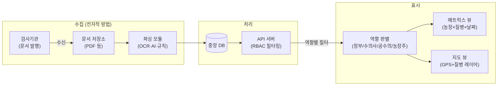
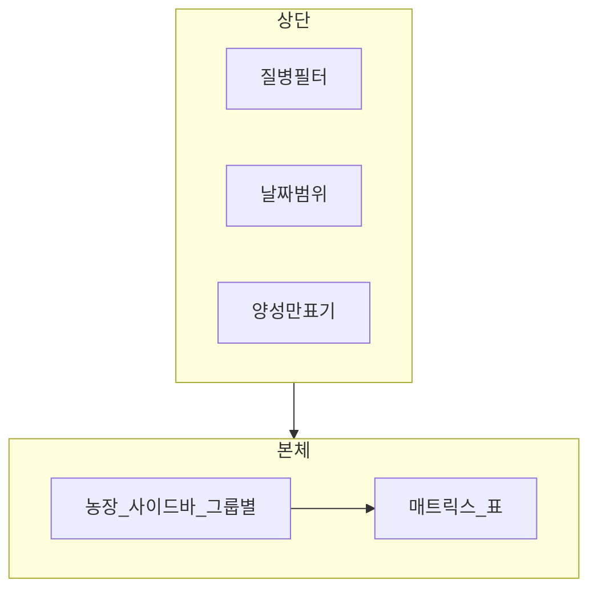
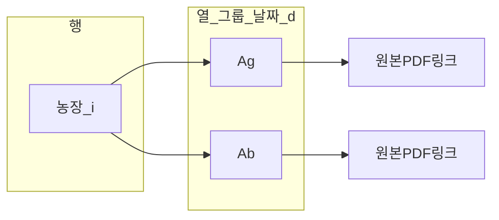
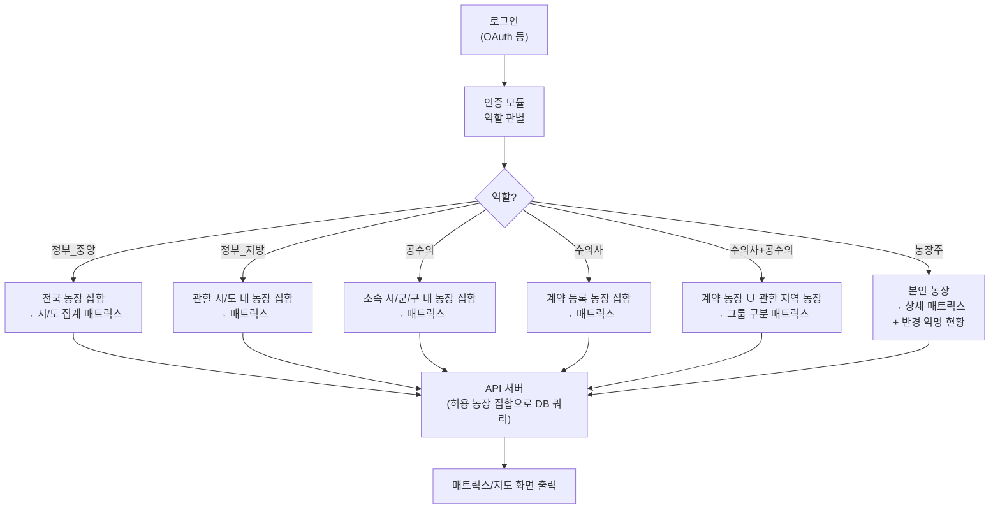
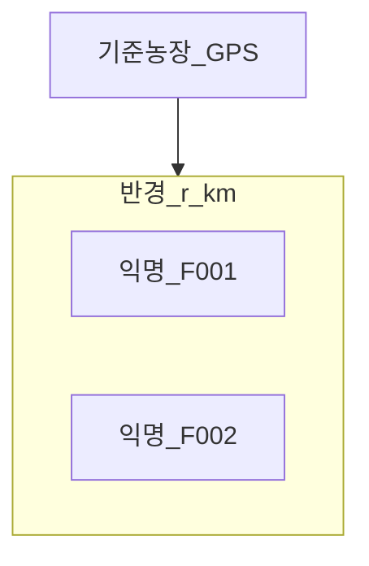
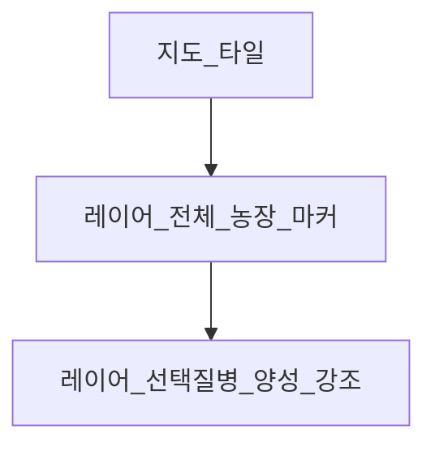

# 특허 명세서 초안 (임시출원용)

> 작성일: 2026-04-03 (보강: 2026-04-04 — 선행기술 메모·파이프라인 개시·실시예·도면 개요 / 2026-04-05 — 코드 리뷰 반영·구현상태 업데이트·파이프라인 기술중립화·도면1·4 재작성)
> 발명자: (박지형)
> 상태: 임시출원 초안 — 정식출원 전 특허사무소 검토 필요
> 참고: 임시출원은 정형화된 양식 불필요. 이 문서가 출원일 확보용 개시 자료가 됨.
> **프로토타입 구현 현황**: 아래 「구현 현황 (프로토타입 대비)」 절의 표를 참조.

---

## 발명의 명칭

**축산 방역을 위한 다중 농장 질병 검사결과 매트릭스 시각화 및 역할 기반 접근 제어 시스템과 그 방법**

(영문) System and Method for Matrix Visualization of Livestock Disease Test Results and Role-Based Access Control for Veterinary Epidemic Prevention

---

## 기술분야

본 발명은 축산 방역 정보 시스템에 관한 것으로, 보다 구체적으로는 복수의 농장으로부터 수집된 질병 검사결과 데이터를 농장·질병·날짜 3축 매트릭스 형태로 시각화하고, 사용자의 역할(정부기관, 진료수의사, 공수의, 농장주 등)에 따라 접근 가능한 데이터 범위를 차등 제어하는 웹 기반 플랫폼 시스템 및 방법에 관한 것이다.

---

## 배경기술

### 현황 및 문제점

1. **분산된 검사결과 관리**: 현재 양돈 농장의 질병 검사결과는 각 검사기관(국립동물검역원, 대학 수의과, 민간 검사기관 등)이 개별적으로 PDF 또는 서면 형태로 발급하며, 이를 한 곳에서 통합 조회하는 시스템이 존재하지 않는다.

2. **수기 관리의 한계**: 돼지진료 수의사 및 농장 관리자는 다수 농장의 질병 검사결과를 엑셀 파일 또는 수기 장부로 관리하고 있어, 특정 질병의 발생 추이나 복수 농장 간 비교가 어렵다.

3. **방역 정보의 비대칭성**: 정부(농림축산식품부, 지자체), 수의사, 공수의, 농장주 간에 질병 정보 공유가 체계적으로 이루어지지 않아, PRRS·PED 등 전염성 질병의 조기 발견 및 차단이 지연될 수 있으며, ASF·FMD 등의 질병 발생정보의 접근이 원활하지 않은 실상이다.

4. **검사결과지 디지털화 부재**: 검사기관마다 결과지 PDF 양식이 상이하여, 데이터를 구조화된 형태로 자동 수집·저장하는 시스템이 없다.

5. **원본 검사지 접근성**: 매트릭스 요약 데이터에서 전체 결과를 확인하고, 그 중 필요한 결과를 날짜·검사결과에 따라 클릭하여 원본 데이터를 찾아볼 수 있어, 누적 검사기록 관리에 용이하며 변동사항 확인이 용이하다. *(본 발명의 특징)*

### 종래기술의 문제점

- 기존 축산 방역 시스템(KAHIS 등)은 법정 전염병 신고 중심으로, 일상적인 검사결과(PRRS 항체가, PED 항원 등)의 통합 조회 기능이 없다.
- 농장 단위 정보 보호와 방역 정보 공개 간의 균형을 위한 익명화 + 반경 공개 방식이 적용된 시스템이 없다.
- 항원(Ag) 검사와 항체(Ab) 검사 결과를 동일 질병의 서로 다른 검사 타입으로 구분하여 한 화면에서 비교할 수 있는 UI가 없다.

### 선행기술 조사 (참고)

- **조사일**: 2026-04-04. **조사처**: KIPRIS(KIPRIS Plus), Google Patents.
- **검색어 (예시)**: `livestock disease surveillance`, `pig herd health dashboard`, `축산 방역 정보`, `PRRS`, `veterinary epidemiology`, `role-based access`, `matrix visualization`.
- **대표 선행문헌 (예)**:
  - **US10993417B2** (예: IBM 등): 가축 질병 발생·관리를 **건강 그래프(Health graph) 네트워크**로 모델링하는 기술. **다기관 검사결과 PDF의 이메일 수신·파싱·농장 식별자 매핑** 후 **농장×날짜×질병×Ag/Ab 매트릭스 셀**로 집계·표시하고, **역할(정부기관·수의사·공수의·농장주)별 농장 집합**과 **반경 기반 익명 인근 현황**을 결합한 구성은 상기 문헌만으로는 알 수 없다.
  - **국내 법정 방역·신고 계열 시스템(예: KAHIS 등)**: 법정 전염병 **신고·관리** 중심으로, 일상 임상 검사(PRRS·PED 등) 결과의 **다농장 매트릭스 통합 조회·Ag/Ab 동시 비교**를 다루지 않는다.
- **대비 요약** (심사·무효 대응용 메모; 정식출원 시 변리사와 선행문헌 확정):

| 본 발명에서 강조하는 결합 | 선행 대비 차별 포인트(메모) |
|---------------------------|---------------------------|
| 이메일·PDF 수신 후 구조화·DB 반영 | 신고 중심 시스템·그래프 네트워크 모델과 **데이터 입력 경로·집계 단위**가 다름 |
| 농장(행)×(날짜·질병·검사타입)(열)·셀 상태 | 단일 농장·단일 뷰·신고 목록과 **다농장 비교 매트릭스**가 다름 |
| 역할별 농장 집합 + API/DB 필터 | 일반 RBAC과 **축산 역할·행정구역·계약 농장**의 구체 결합 |
| 반경 내 익명 + 질병 선택 | 개인정보 보호와 방역 정보 공개의 **지리·익명 정책**을 UI·데이터 처리와 결합 |

※ 정식출원 전 **KIPRIS·해외 DB 재검색** 및 **인용문헌·대비표** 확정은 변리사와 협의할 것.

---

## 발명의 내용

### 해결하려는 과제

본 발명은 상기 문제점을 해결하기 위하여,

1. 복수 농장의 질병 검사결과를 **농장(행) × 질병/검사타입(열) × 날짜(열 그룹)** 3축 매트릭스로 표현하여 한 화면에서 방역 현황을 파악할 수 있는 시각화 방법을 제공한다.

2. 사용자 역할(정부기관, 수의사, 공수의, 농장주)에 따라 **접근 가능한 농장 범위를 자동으로 제한**하는 역할 기반 접근 제어(RBAC) 방법을 제공한다.

3. 농장 고유식별코드를 통한 **익명화 + 반경(1/3/5/10km) 기반 질병 현황 공개** 방법을 제공한다.

4. 검사결과 셀에서 **원본 검사 문서(PDF)로의 직접 접근** 방법을 제공한다.

5. 전국 또는 관할 구역 내 농장을 지도상에 표시하고, 특정 질병 선택 시 발생 농장을 지도 레이어로 시각화하는 방법을 제공한다(실시예 5).

6. 특정 질병의 항체가(수치)를 시계열 그래프로 모아보는 방법을 제공한다(실시예 6).

---

### 과제의 해결 수단

본 발명의 일 실시예에 따른 시스템은 **서버 컴퓨터**, **데이터베이스**, **클라이언트(웹 브라우저)** 및 이들 간 **통신 프로토콜(예: HTTP API)** 로 구현되며, 접근 제어·반경 연산·매트릭스 집계는 **소프트웨어가 저장 매체에 기록된 데이터에 대해 수행하는 처리**로서 하드웨어·데이터 처리와 불가분하게 결합된다.

본 발명에 따른 시스템은 다음 구성 요소를 포함한다.

#### 구성 1: 3축 매트릭스 시각화 엔진

- **행(Row)**: 농장 목록 — 계층적 그룹(직영/협력/위탁 등) 단위로 구조화
- **열(Column)**: 검사 날짜 × 질병 × 검사타입(항원 Ag / 항체 Ab)의 복합 컬럼 구조
- **셀(Cell)**: 검사 결과를 기호(+, -, ?)와 색상(양성=빨강, 음성=회색, 의심=주황)으로 표현
- **셀 클릭**: 해당 결과의 원본 검사 문서(PDF) 직접 호출

동일 질병(예: PRRS)의 항원(Ag)과 항체(Ab) 결과를 같은 날짜 컬럼 내에서 나란히 배치하여, 방역 판단에 필요한 두 가지 검사 타입을 단일 화면에서 비교할 수 있다.

#### 구성 2: 다중 필터링 시스템

다음 필터를 독립적으로 또는 복합 적용할 수 있다:

| 필터 종류 | 설명 |
|-----------|------|
| 농장 선택 필터 | 복수 농장 동시 선택, 그룹 단위 일괄 선택 |
| 질병 선택 필터 | PRRS, PED, SIV, PCV2, **MH**, **MHR**, APP, 세균, 유전자 등 체크박스 *(예: MH=Mycoplasma hyopneumoniae, MHR=Mycoplasma hyorhinis 분리)* |
| 날짜 범위 필터 | 1/3/6개월, 1년, 전체 또는 직접 입력 |
| 양성만 표기 필터 | 음성(-) 결과를 숨기고 양성·의심만 표시 |

#### 구성 3: 역할 기반 접근 제어 (RBAC)

사용자 역할에 따라 조회 가능한 농장 범위가 자동으로 제한된다:

| 역할 | 접근 범위 |
|------|-----------|
| 정부기관(중앙·지자체) | 전국 또는 관할 도·시군 내 모든 농장 |
| 돼지진료 수의사 | 용역 계약이 등록된 농장만 |
| 공수의 | 소속 시군 또는 도 내 농장만 |
| 농장주 | 자기 농장 (상세) + 반경 내 익명 농장 현황 |

#### 구성 4: 농장 익명화 + 반경 공개

- 모든 농장에 고유식별코드 부여 (농장주 개인정보 비노출)
- 농장주 및 수의사: 특정 질병 선택 시 반경 1/3/5/10km 내 익명 농장의 발생 현황 조회 가능
- 코드 ↔ 실제 농장 매핑은 정부 시스템 내부에서만 관리

#### 구성 5: 검사결과 자동 수집 파이프라인

```
[검사기관 검사결과 문서 발행]
      ↓ (전자적 방법으로 수신: 이메일·API·포털 등 구현 방식에 무관)
[첨부 문서(PDF 등) 저장]
      ↓ (OCR / AI / 규칙 기반 파싱 등)
[구조화 데이터 추출: 농장명, 날짜, 질병, 결과값]
      ↓
[중앙 데이터베이스 저장]
      ↓
[매트릭스 대시보드 실시간 반영]
```

**구성 5-1: 검사기관별 비정형 결과지의 식별·정규화 (일 실시예)**

검사기관·발행 연도·PDF 레이아웃에 따라 **파일명 규칙**, **본문 내 농장 표기**, **검사종류 명칭**이 상이하므로, 다음과 같은 **전처리·정규화**를 포함할 수 있다.

- **기관·형식 감지**: 파일명 또는 본문에 포함된 기관 식별자·키워드에 따라 파서(템플릿·규칙·OCR 후처리)를 선택한다.
- **농장 식별자 매핑**: 추출된 문자열에 대해 (i) 등록된 DB 농장 코드와의 일치, (ii) 별칭·축약 코드 테이블, (iii) 부분 문자열(농장명)·숫자 코드(예: 4자리 구역코드+농장명 패턴) 기반 매칭을 수행하여 **시스템 내부 농장 식별자**로 정규화한다.
- **검사종류·질병 매핑**: 기관별 용어(예: ELISA·PCR·세균 배양 등)를 **질병 코드** 및 **검사 타입(항원/항체 등)** 으로 매핑한다.
- **결과값 정규화**: 양성/음성/의심·수치(S/P 등)를 내부 스키마에 맞게 변환한 뒤 DB에 저장한다.

위 절차는 일반적인 “OCR”만으로는 달성하기 어려운 **축산 검사 실무에 특화된 구조화 파이프라인**에 해당한다(세부 테이블·규칙은 출원인이 보유하는 실시 데이터에 따라 달라질 수 있음).

#### 구성 6: 지도 시각화 (실시예 5)

- 전국 또는 권한 범위 내 농장을 GPS 좌표 기반 지도 위에 표시한다.
- 사용자가 질병을 선택하면 해당 질병 **양성(또는 관심 판정)** 발생 농장만 강조 표시한다(레이어 방식).
- 매트릭스 뷰와 지도 뷰 간 전환 또는 병행 표시가 가능하다.

#### 구성 7: 항체가 추이 시각화 (실시예 6)

- 개별 농장별 특정 질병(PRRS, MH, APP 등)의 항체가(수치)를 시계열 그래프로 표시한다.
- 양성/음성 이진 판정과 별도로, **실수치(예: S/P 비, 역가)** 를 저장하는 필드 또는 테이블을 두어 시계열을 구성한다.
- 복수 농장 간 항체가 비교 기능을 포함할 수 있다.

---

### 발명의 효과

1. **방역 효율 향상**: 수의사 1인이 담당하는 수십 개 농장의 질병 현황을 한 화면에서 즉시 파악 가능하여, 개별 결과지 검토 시간 대폭 단축.

2. **조기 경보**: 특정 농장 또는 지역에서 특정 질병의 양성률이 증가하는 시점을 매트릭스 패턴으로 조기 식별 가능.

3. **정보 접근 민주화**: 농장주가 인근 지역 질병 발생 현황을 익명화된 형태로 확인할 수 있어, 자발적 방역 조치 실행 가능.

4. **데이터 무결성**: 검사결과 셀에서 원본 PDF로 직접 접근함으로써, 요약 데이터와 원본 문서 간 불일치 즉시 확인 가능.

5. **확장성**: 역할 기반 접근 제어 구조를 통해 정부기관·지자체·민간 수의 조직이 동일 플랫폼에서 역할에 맞는 정보만 접근하는 통합 방역 정보망 구성 가능.

6. **선행 대비 통합 효과**: 다기관 PDF 수집·농장 정규화·매트릭스 집계·역할별 필터·반경 익명이 **하나의 방역 정보 흐름**으로 연결되어, 신고 중심 시스템이나 단일 분석 모델만으로는 얻기 어려운 **다농장·다역할 운영 시나리오**를 지원한다.

---

> 📋 **구현 현황 (프로토타입 대비)**: 별도 내부 문서 [`구현현황_내부참고.md`](구현현황_내부참고.md) 참조.

---

## 도면의 간단한 설명

- **[도면 1]** 전체 시스템 구성도 (이메일 수신 → 파싱 → DB → 대시보드 흐름)
- **[도면 2]** 매트릭스 대시보드 화면 구성 (농장 사이드바, 질병 필터, 날짜 범위, 매트릭스 본체)
- **[도면 3]** 매트릭스 셀 구조 상세 (Ag/Ab 분리 컬럼, +/-/? 기호, 색상 코딩, PDF 링크)
- **[도면 4]** 역할별 접근 제어 흐름도 (로그인 → 역할 판별 → 접근 범위 결정 → 데이터 필터링)
- **[도면 5]** 농장 익명화 + 반경 공개 개념도 (GPS 좌표, 반경 원, 익명 코드 표시)
- **[도면 6]** 전국(또는 관할) 농장 지도 + 질병 레이어 화면(실시예 5)
- **[도면 7]** 항체가 시계열 그래프 화면(실시예 6)

> 도면은 실제 화면 캡처 또는 다이어그램으로 대체 가능 (임시출원 단계). 아래 「도면 개요」는 명세서용 블록도·흐름도 예시이다.

---

## 도면 개요 (명세서용 블록도·화면 개요)

### [도면 1] 전체 시스템 구성 (예시)



### [도면 2] 매트릭스 대시보드 화면 구성 (예시)



### [도면 3] 매트릭스 셀·열 구조 (예시)



### [도면 4] 역할 기반 접근 제어 흐름도 (예시)



### [도면 5] 반경 익명 공개 (예시)



### [도면 6] 지도 + 질병 레이어 (예시)



### [도면 7] 항체가 시계열 (예시)


---

## 발명을 실시하기 위한 구체적인 내용

### 용어 및 매트릭스 축의 정의

- **농장 식별자(행안부 가축사육업 허가번호)**: 시스템이 농장 레코드를 구분하는 코드(예: `xxxx` 형). 매트릭스의 **행**과 1:1로 대응된다.
- **익명 표시 코드**: 외부 공개·인근 현황 등에서 농장명·주소 대신 사용하는 코드(예: `F-XXXX`). **내부 DB 코드**와의 매핑은 서버 측에서만 유지한다.
- **매트릭스의 “3축”**: (1) **행 축** — 복수 농장(또는 그룹 단위 정렬); (2) **열 축** — 검사일·질병·검사타입(항원/항체 등)의 조합으로 정의된 컬럼(동일 날짜에 PRRS Ag/Ab를 인접 **서브컬럼**으로 두는 경우 포함); (3) **셀** — 특정 농장·특정 열 조합에 대응하는 최신(또는 대표) 검사 결과 및 원본 문서 링크. “날짜”는 열 헤더 상에서 그룹핑되거나 정렬 키로 사용될 수 있다.

### 실시예 1: 매트릭스 시각화

수의사 A가 담당하는 농장 30곳의 PRRS 검사결과를 조회하는 경우:

1. 로그인 후 역할(수의사) 인증 → 담당 농장 목록 자동 로드
2. 질병 필터에서 'PRRS' 선택 → PRRS 항원(Ag)·항체(Ab) 컬럼만 표시
3. 날짜 범위 '3개월' 선택 → 최근 3개월 검사결과 표시
4. '양성만 표기' 체크 → 음성(-) 결과 숨김, 양성(+)/의심(?) 결과만 강조
5. 특정 셀의 '+' 클릭 → 해당 검사결과 PDF 원본 파일 즉시 열람

### 실시예 2: 역할 기반 접근 제어

공수의 B(전북 익산시 소속)가 로그인하는 경우:

1. 로그인 시 소속 시군(익산시) 자동 인식
2. 사이드바 농장 목록: 익산시 관할 농장만 표시
3. 익산시 외 농장 데이터는 API 수준에서 필터링되어 응답 불가
4. 매트릭스: 익산시 농장만 표시

### 실시예 3: 반경 기반 익명 현황

농장주 C(농장 코드: F-0042)가 인근 PRRS 현황 조회:

1. 로그인 → 본인 농장(F-0042) 상세 데이터 표시
2. '인근 현황' 탭 선택 → 반경 설정(예: 5km)
3. 질병 선택: 'PRRS'
4. 지도 또는 목록에 반경 5km 내 농장이 익명 코드(F-XXXX)로 표시
5. 각 익명 농장의 PRRS 최근 검사결과(양성/음성)만 표시 (농장명·주소 비노출)

### 실시예 4: 자동 수집 파이프라인

검사기관이 결과지 문서(PDF 등)를 발행하는 경우:

1. 시스템이 전자적 방법(이메일 수신, API 연계, 파일 업로드 포털 등 구현 방식에 무관)으로 문서를 수신
2. 수신된 문서를 스토리지에 저장
3. 기관·양식별 파싱 모듈(OCR, AI, 규칙 기반 등)을 적용하여 농장명, 검사일자, 질병, 결과값 추출
4. 농장 식별코드 매핑 후 DB 저장
5. 대시보드 매트릭스 실시간 갱신

### 실시예 5: 지도 기반 질병 발생 시각화

역할이 허용하는 농장 집합에 대해 지도 상에서 질병별 발생을 강조 표시하는 경우:

1. 각 농장 레코드에 위도·경도(또는 좌표계 변환 가능한 주소 지오코딩 결과)를 저장한다.
2. 사용자 로그인 후 접근 제어 모듈이 조회 가능한 농장 식별자 집합 **S**를 결정한다.
3. 클라이언트는 지도 타일(또는 벡터 지도) 위에 **S**에 속한 농장을 마커로 표시한다.
4. 사용자가 질병 **d**를 선택하면, 질병 **d**에 대해 최근 검사에서 양성(또는 정책상 “발생”에 해당하는 판정)인 농장 마커만 별도 레이어에서 강조(색·크기·애니메이션 등)한다.
5. 매트릭스 화면과 지도 화면을 탭 전환 또는 분할 화면으로 연동할 수 있다.

### 실시예 6: 항체가 시계열 표시

항체 검사의 정량·준정량 수치를 시계열로 분석하는 경우:

1. 검사 레코드에 **이진 판정**(양성/음성) 외에 **항체가 수치**(예: S/P 비, 역가, 흡광도) 필드를 저장한다(구성 7).
2. 사용자가 농장 **f**와 질병 **d**를 선택하면, **(f, d)** 에 해당하는 검사일자 순으로 수치를 조회한다.
3. 가로축을 시간, 세로축을 수치로 하는 시계열 그래프를 생성한다.
4. 복수 농장을 선택한 경우 동일 질병에 대해 **동일 시간축** 위에 복수 곡선을 겹쳐 표시하여 비교한다.

---

## 청구범위

### 독립 청구항

**청구항 1**
복수의 축산 농장에 대한 질병 검사결과 데이터를 처리하는 컴퓨터 구현 방법으로서,
- 복수의 농장 식별자를 행(Row)으로, 검사 날짜와 질병 종류 및 검사 타입(항원/항체)의 조합을 열(Column)로 구성하는 3축 매트릭스 데이터 구조를 생성하는 단계;
- 각 셀(Cell)에 해당 농장·날짜·질병의 검사 결과를 양성, 음성, 의심 중 하나로 표시하고, 결과에 대응하는 시각적 기호 및 색상을 부여하는 단계;
- 사용자의 선택에 따라 하나 이상의 질병 종류, 날짜 범위, 농장 그룹을 필터링하여 매트릭스를 갱신하는 단계;
를 포함하는 것을 특징으로 하는 축산 방역 정보 시각화 방법.

**청구항 2**
청구항 1에 있어서,
각 셀은 해당 검사결과에 대응하는 원본 검사 문서(PDF)와 연결되어, 셀 선택 시 원본 문서를 직접 표시하는 것을 특징으로 하는 방법.

**청구항 3**
청구항 1에 있어서,
동일 질병의 항원(Ag) 검사결과와 항체(Ab) 검사결과를 동일 날짜 컬럼 내 인접한 서브-컬럼으로 배치하여 단일 화면에서 비교 가능하게 표시하는 것을 특징으로 하는 방법.

**청구항 4**
복수의 축산 농장에 대한 질병 정보를 제공하는 시스템으로서,
- 사용자 인증 시 사용자의 역할(정부기관, 수의사, 공수의, 농장주 중 하나)을 판별하는 인증 모듈;
- 판별된 역할에 따라 접근 가능한 농장 범위를 자동으로 결정하는 접근 제어 모듈;
  - 정부기관: 전국 또는 관할 행정구역 내 전체 농장
  - 수의사: 컨설팅 계약이 등록된 농장
  - 공수의: 소속 행정구역 내 농장
  - 농장주: 본인 농장 및 반경 내 익명 농장
- 접근 허용된 농장의 질병 검사결과를 매트릭스 형태로 출력하는 표시 모듈;
을 포함하는 것을 특징으로 하는 축산 방역 정보 시스템.

**청구항 5**
청구항 4에 있어서,
농장주 또는 수의사가 특정 질병을 선택하고 반경(1km, 3km, 5km, 10km 중 하나 이상)을 지정하면, 해당 반경 내 농장을 고유식별코드로 익명화하여 선택 질병의 발생 현황만 표시하는 반경 공개 모듈을 더 포함하는 것을 특징으로 하는 시스템.

**청구항 6**
청구항 4에 있어서,
전국 농장의 GPS 좌표를 지도 위에 표시하고, 사용자가 선택한 질병에 대한 양성 발생 농장을 지도 레이어로 강조 표시하는 지도 시각화 모듈을 더 포함하는 것을 특징으로 하는 시스템.

> *(확장 메모)*: 필요 시 지역별 거리 차등에 따라 공무원이 행정문자 발송 시스템을 편입하여 관할 시군 농장에 질병 발생 정보를 발송하고 관리하는 기능을 추가할 수 있다.

### 종속 청구항

**청구항 7**
청구항 1에 있어서,
검사기관으로부터 전자적 방법으로 수신된 검사결과 문서를, 기관별 비정형 양식에 대응하는 파싱 모듈을 통해 농장 식별자·검사일·질병·결과값으로 구조화하여 데이터베이스에 저장하고, 상기 매트릭스를 자동으로 갱신하는 단계를 더 포함하는 방법.

**청구항 8**
청구항 1에 있어서,
특정 농장의 특정 질병에 대한 항체가(수치값)를 시간축에 따라 시계열 그래프로 표시하는 단계를 더 포함하는 방법.

**청구항 9**
청구항 4에 있어서,
검사기관으로부터 전자적 방법으로 수신된 검사결과 문서를, 기관·양식별 파싱 모듈을 통해 농장 식별자·검사일·질병·결과값으로 구조화하여 데이터베이스에 저장하고, 상기 매트릭스를 자동으로 갱신하는 자동 수집 모듈을 더 포함하는 것을 특징으로 하는 시스템.

**청구항 10**
청구항 4에 있어서,
특정 농장의 특정 질병에 대한 항체가(수치값)를 시간축에 따라 시계열 그래프로 표시하는 항체가 시각화 모듈을 더 포함하는 것을 특징으로 하는 시스템.

---

## 요약서

**발명의 명칭**: 축산 방역을 위한 다중 농장 질병 검사결과 매트릭스 시각화 및 역할 기반 접근 제어 시스템과 그 방법

**요약**:
본 발명은 복수 축산 농장의 질병 검사결과를 농장·질병·날짜 3축 매트릭스로 통합 시각화하고, 사용자 역할에 따라 접근 가능한 농장 범위를 자동 제어하는 웹 기반 방역 정보 시스템 및 방법에 관한 것이다. 매트릭스 각 셀은 검사 결과(양성/음성/의심)를 기호·색상으로 표시하며, 셀 선택 시 원본 검사 문서로 직접 접근 가능하다. 동일 질병의 항원·항체 검사결과를 인접 서브-컬럼으로 구분 표시하고, 질병·날짜·농장·양성여부의 복합 필터링을 지원한다. 역할 기반 접근 제어에 의해 정부기관은 전체, 수의사는 담당 농장, 공수의는 관할 구역, 농장주는 자기 농장만 접근하며, 농장주는 인근 반경 내 익명 농장의 질병 현황도 확인할 수 있다. 다기관 검사결과의 이메일 수신·파싱·농장 식별자 정규화, 권한 범위 내 지도 레이어로의 질병별 강조, 항체가 시계열 표시는 일 실시예에 포함될 수 있다.

**대표 도면**: [도면 2] 매트릭스 대시보드 화면 구성

---

## 부록: 임시출원 전 체크리스트

- [ ] 발명자 성명·주소 확인
- [ ] 대리인(변리사) 선임 여부 결정 (개인 출원 시 불필요)
- [ ] 도면 제작 (화면 캡처 + 시스템 구성도)
- [x] 선행기술 조사 메모 반영 (본 문서 `선행기술 조사 (참고)`; 정식출원 전 KIPRIS·해외 DB 재검색 및 인용문헌 확정)
  - 검색어 예시: "축산 방역 대시보드", "livestock disease surveillance matrix", "수의 진단 정보 시스템"
- [ ] 특허청 전자출원 시스템(특허로) 회원가입
- [ ] 출원료 확인 (개인 발명자 감면 여부)
- [ ] 임시출원 후 12개월 내 정식출원 기한 관리
